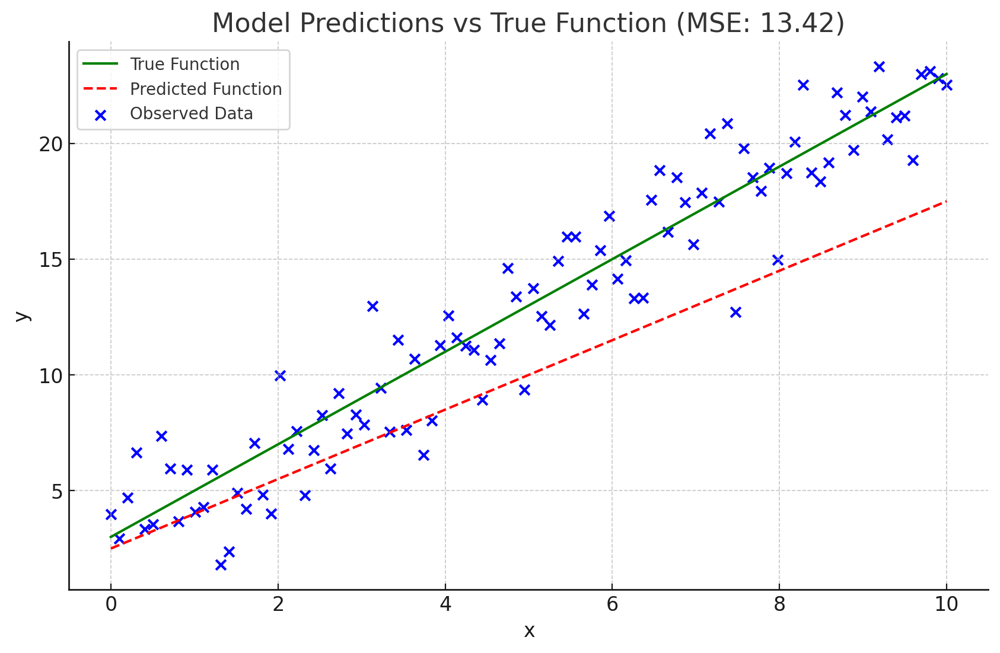

# Model Components

###### [Progress] January 6, 2024
###### [Progress] Elaborated notes from [Little Book of Deep Learning ](https://fleuret.org/public/lbdl.pdf?fbclid=IwAR3jmeQf1k6Q6Qbp6fDmEtklfqo3XMNrHSoIE_2m8By8cpF2sPZjghuq-Zg)

## What is a layer?
### Linear Layers
"Linear" in deep learning != [linear in math](https://en.wikipedia.org/wiki/Linearity#:~:text=In%20mathematics%2C%20a%20linear%20map,(x)%20for%20all%20%CE%B1.). The linear in layers, refers to an [affine operation](https://youtu.be/E3Phj6J287o?si=YW0ya5B9iY3OtiQb) (linear transformation): 

$$ y = Ax + b $$

Where: 
- y = is the transformed vector.
- A = is a linear transformation matrix.
- x = is the original vector.
- b = is a translation vector.

### Dense Layers/fully connected layers
The fully connected layer (every neuron is connected) is simple affine transformation that can work with input/outputs from multi-dimensional tensors.

<details>
  <summary>Python Function to Visualize Fully Connected Layer</summary>

```python
import numpy as np
import matplotlib.pyplot as plt
import seaborn as sns

def visualize_affine_transformation(input_dims, output_dim):
    """
    Visualize the affine transformation performed by a fully connected layer.

    :param input_dims: Dimensions of the input tensor (excluding the last dimension).
    :param output_dim: Dimension of the output tensor's last dimension.
    """
    # Generate a random input tensor with the specified dimensions
    input_tensor = np.random.randn(*input_dims)

    # Initialize the weight matrix and bias vector
    W = np.random.randn(output_dim, input_dims[-1])
    b = np.random.randn(output_dim)

    # Applying affine transformation for each vector in the input tensor
    reshaped_input = input_tensor.reshape(-1, input_dims[-1])  # Flatten input except for the last dimension
    transformed = np.dot(reshaped_input, W.T) + b  # Apply affine transformation
    output_tensor = transformed.reshape(*input_dims[:-1], output_dim)  # Reshape to the output tensor

    # Visualization
    plt.figure(figsize=(12, 6))

    # Visualizing the input tensor
    plt.subplot(1, 2, 1)
    plt.imshow(input_tensor.reshape(-1, input_dims[-1]), aspect='auto', cmap='viridis')
    plt.colorbar()
    plt.title("Input Tensor")

    # Visualizing the output tensor
    plt.subplot(1, 2, 2)
    plt.imshow(output_tensor.reshape(-1, output_dim), aspect='auto', cmap='viridis')
    plt.colorbar()
    plt.title("Output Tensor (After Affine Transformation)")

    plt.show()

# Example usage: visualizing a 2D input tensor transforming to a different dimension
visualize_affine_transformation(input_dims=(10, 20), output_dim=5)
```
</details>



<!--START OF FOOTER-->
<hr style="margin-top:9px;height:1px;border: 0;background-image: linear-gradient(to right, rgba(0, 0, 0, 0.0), rgba(0, 0, 0, 0.5),rgba(0, 0, 0, 0.0));">
<!--START OF ISSUE NAVIGATION LINKS-->
<!--START OF ISSUE NAVIGATION LINKS-->
<!--END OF FOOTER-->
