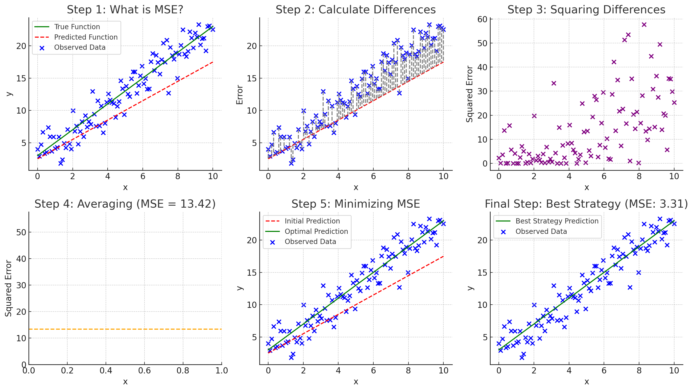

# 1.2 Basis Function Regression

###### [Progress] Started: Jan 20 2024. Last Edit: Jan 20 2024
###### [Progress] Elaborated notes from [Little Book of Deep Learning ](https://fleuret.org/public/lbdl.pdf?fbclid=IwAR3jmeQf1k6Q6Qbp6fDmEtklfqo3XMNrHSoIE_2m8By8cpF2sPZjghuq-Zg)

**Mean Squared Error (MSE) - Step by Step**:

- **What is MSE?**:
  - MSE is like an accuracy rating in a video game, where you're trying to hit targets. It tells you how well you're playing by measuring how far off your shots are from the center of the targets.
  
- **How is MSE Calculated?**:
  - The MSE is found using the formula: $\mathcal{L}(w) = \frac{1}{N} \sum_{n=1}^{N} (y_n - f(x_n; w))^2$
  - Imagine you have a scorecard, and for each target, you note down how off-center each shot was, square that number (to make sure that being way off counts a lot more than being just a little off), and then find the average.

- **Breaking Down the Formula**:
  - $\mathcal{L}(w)$: This is your overall game score, where a lower score means better accuracy.
  - $N$: This is the total number of targets you shot at.
  - $y_n$: This is where the center of the nth target was.
  - $x_n$: These are the conditions for each shot, like the angle and wind.
  - $w$: This represents your aiming adjustments. Think of it as your strategy to hit the target center more consistently.
  - $f(x_n; w)$: This is where your shot lands based on your aiming strategy.
  - $\sum_{n=1}^{N}$: This is like tallying up the score for each shot.
  - $(y_n - f(x_n; w))^2$: For each target, you square the distance between where your shot landed and the center.

- **Why Square the Distance?**:
  - Squaring the distance between your shot and the target center makes the score more sensitive to shots that are way off. It's like in games where mistakes cost you more points as they get bigger, so it encourages you to be as accurate as possible.

- **Aim of the Game**:
  - The goal is to adjust your strategy ($w$) to lower your game score ($\mathcal{L}(w)$), meaning your shots are getting closer to the center on average. The best strategy gives you the lowest score and makes you the champion marksman of the game.

