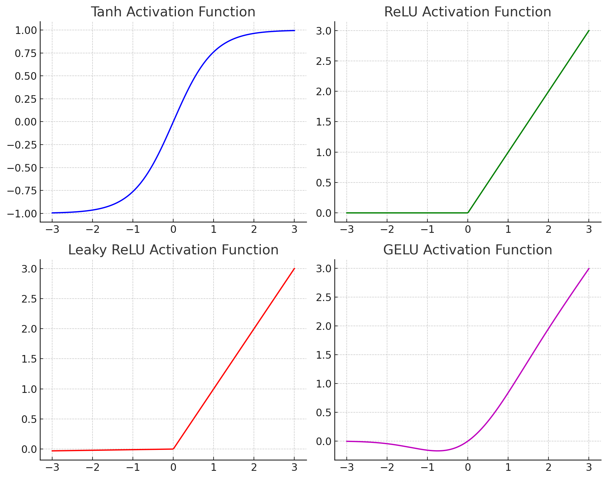

# 4.3 Model Components: Activation Function

###### [Progress] Started: Jan 9 2024. Last Edit: Jan 9 2024
###### [Progress] Elaborated notes from [Little Book of Deep Learning ](https://fleuret.org/public/lbdl.pdf?fbclid=IwAR3jmeQf1k6Q6Qbp6fDmEtklfqo3XMNrHSoIE_2m8By8cpF2sPZjghuq-Zg)

## Activation Functions
If a network only has linear components, it can't represent non-linear patterns between hierarchical features. For example how do we map images (edges, textures, and shapes) and language (context, syntax, and semantics) to an output? You need more generalizable representation power.

Without non-linearity, a multi-layer neural network = [single-layer perceptron](https://en.wikipedia.org/wiki/Perceptron#Learning_algorithm_for_a_single-layer_perceptron). 

The most popular activation function is called Rectified Linear Unit (ReLU): 

$$ \text{ReLU}(x) = \max(0, x) $$

So if (-) val, set to 0, else keep (+) vals. Other popular functions include Tanh, Leaky ReLU, and GELU. The choice of ReLU is driven by empirical performance.

 

<details>
  <summary>Code for Activation Functions</summary>

```python
import numpy as np
import matplotlib.pyplot as plt
from scipy.special import erf

# Define the activation functions
def relu(x):
    return np.maximum(0, x)

def leaky_relu(x, alpha=0.01):
    return np.where(x > 0, x, x * alpha)

def gelu(x):
    return 0.5 * x * (1 + erf(x / np.sqrt(2)))

def tanh(x):
    return np.tanh(x)

# Generate a range of values
x = np.linspace(-3, 3, 300)

# Plot the activation functions
fig, axs = plt.subplots(2, 2, figsize=(10, 8))

# Tanh
axs[0, 0].plot(x, tanh(x), 'b')
axs[0, 0].set_title('Tanh Activation Function')
axs[0, 0].grid(True)

# ReLU
axs[0, 1].plot(x, relu(x), 'g')
axs[0, 1].set_title('ReLU Activation Function')
axs[0, 1].grid(True)

# Leaky ReLU
axs[1, 0].plot(x, leaky_relu(x), 'r')
axs[1, 0].set_title('Leaky ReLU Activation Function')
axs[1, 0].grid(True)

# GELU
axs[1, 1].plot(x, gelu(x), 'm')
axs[1, 1].set_title('GELU Activation Function')
axs[1, 1].grid(True)

# Adjust layout
plt.tight_layout()
plt.show()
```

</details>
